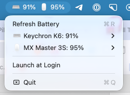

# Battery for Keychron

A lightweight macOS menu bar app that shows the battery level of your Keychron keyboard, and other Bluetooth devices like your mouse and headphones, with an alert when a battery gets low.



> Based on [rxrdev/keychron-battery-level](https://github.com/rxrdev/keychron-battery-level) by Razvan. This fork fixes keyboards connected over Bluetooth, which did not show up in the original app, and adds low battery alerts and energy-saving refresh settings. Not affiliated with Keychron.

## What's different from the original

- **Keychron keyboards on Bluetooth now show up.** Keyboards such as the K6 connect over Bluetooth Classic and identify with Apple's vendor ID, so the original app never found them (see [rxrdev/keychron-battery-level#2](https://github.com/rxrdev/keychron-battery-level/issues/2)). This version reads the standard HID battery field these keyboards report.
- **Low battery alert.** A notification when a device drops to 20%, sent once per device and not repeated until it has been charged above 25%.
- **Gentler on your Mac's battery.** Refreshes every 15 minutes by default (10, 15 or 20 in the menu, was 5), lets macOS batch the wake-ups, and refreshes once after wake from sleep.
- **Correct icons.** Mice, headphones and controllers get their own icon instead of all showing as a keyboard.

## Features

- 🔋 Battery percentage for each connected device in the menu bar, e.g. `⌨️ 91%  🖱️ 95%`
- 🔔 Low battery notification at 20% (toggle in the menu)
- ⏱️ Refresh every 10, 15 or 20 minutes, plus **Refresh Battery** (⌘R) on demand
- 🎨 Color-coded levels: red at 10% or below, orange at 30% or below
- 🎭 Per-device icon: hover a device in the menu to pick Keyboard, Mouse, Gamepad or Headphones
- 🚀 Launch at Login

## Supported devices

| Device | Status |
|---|---|
| Keychron K6 on Bluetooth | ✅ Confirmed |
| Other Keychron keyboards on Bluetooth (K2, K7, K8, …) | Likely: any keyboard that reports the standard HID battery field should work. Please open an issue with your result |
| Bluetooth Low Energy devices with a battery service (e.g. Logitech MX Master 3S) | ✅ Confirmed |
| Keychron over USB cable or 2.4 GHz dongle | Experimental (original Raw HID code, untested) |

## Requirements

- macOS 15.7 or later

## Installation

1. Download the latest `BatteryForKeychron-vX.X.X.dmg` from [Releases](https://github.com/chamberneezy/battery-for-keychron/releases).
2. Open the DMG and drag **Battery for Keychron** to Applications.
3. **First launch:** the app isn't notarized by Apple, so right-click it and choose **Open**, then **Open** again. If macOS still blocks it, go to System Settings → Privacy & Security and click **Open Anyway**.
4. Allow **Bluetooth** and **Notifications** when prompted.
5. Go to System Settings → Privacy & Security → **Input Monitoring**, turn on **Battery for Keychron**, then quit and reopen the app.

### Why Input Monitoring?

macOS protects keyboards, so any app that reads from a keyboard, even just its battery level, needs this permission. The app does not read or record keystrokes. It only requests the battery report.

### Updating

macOS ties Input Monitoring to the exact build of the app. After installing a new version, remove **Battery for Keychron** from Input Monitoring with **–**, add it again with **+**, and relaunch.

## Usage

Click the menu bar item to see:

- **Device list**: each device with its battery level; hover to change its icon
- **Refresh Battery** (⌘R)
- **Launch at Login**
- **Refresh Every**: 10, 15 or 20 minutes
- **Alert at 20%**: turn low battery notifications on or off. Hold **⌥ Option** to reveal **Send Test Alert**
- **Quit**

## Troubleshooting

**The keyboard doesn't appear, only the mouse**
- Check Input Monitoring is on for the app (remove and re-add it after an update), then quit and reopen the app.
- Check your keyboard is connected in System Settings → Bluetooth.

**Shows `--%`**
- Make sure Bluetooth is on and the app is allowed under Privacy & Security → Bluetooth.
- Click **Refresh Battery**.

**No low battery notification**
- Hold ⌥ Option in the menu and click **Send Test Alert**. If nothing appears, allow notifications for the app in System Settings → Notifications.

**Logs**
```bash
/usr/bin/log show --last 10m --info --predicate 'process == "Battery for Keychron"'
```

## How it works

- **Bluetooth Low Energy devices** (most mice, headphones) are read through CoreBluetooth's Battery Service (`0x180F`).
- **Bluetooth Classic keyboards** are read through IOKit HID: the app finds keyboards and mice that expose the Generic Device Controls / Battery Strength element (usage page `0x06`, usage `0x20`) and requests it with a GET_REPORT.
- The app runs in the App Sandbox with a temporary exception for `IOHIDLibUserClient`, which is needed to open HID devices from a sandboxed app. Because of this exception, the app cannot be distributed through the Mac App Store.

## Building

1. Open `KeychronBattery.xcodeproj` in Xcode.
2. Under **Signing & Capabilities**, select your own team.
3. Press ⌘R.

Or build from the command line with an ad-hoc signature:

```bash
xcodebuild -project KeychronBattery.xcodeproj -scheme KeychronBattery \
           -configuration Release -derivedDataPath ./build \
           CODE_SIGN_IDENTITY="-" CODE_SIGN_STYLE=Manual DEVELOPMENT_TEAM=""
```

The app is at `build/Build/Products/Release/Battery for Keychron.app`.

### Releases

Pushing a version tag builds the app, creates a DMG and publishes a GitHub release through `.github/workflows/release.yml`:

```bash
git tag v2.0.0
git push origin v2.0.0
```

## Project structure

```
KeychronBattery/
├── AppDelegate.swift             # App lifecycle, refresh timer, wake handling
├── BluetoothBatteryHelper.swift  # CoreBluetooth battery monitoring (BLE devices)
├── HIDManager.swift              # IOKit HID battery reading (Bluetooth Classic keyboards)
├── LowBatteryNotifier.swift      # 20% low battery notifications
├── StatusMenuController.swift    # Menu bar item and menu
├── Info.plist
├── KeychronBattery.entitlements  # Bluetooth + HID sandbox exception
└── Assets.xcassets/
```

## Credits

Built on [keychron-battery-level](https://github.com/rxrdev/keychron-battery-level) by Razvan. Thanks for the original app.

Keychron is a trademark of Keychron. This project is not affiliated with or endorsed by Keychron.

## License

MIT, see [LICENSE](LICENSE).
